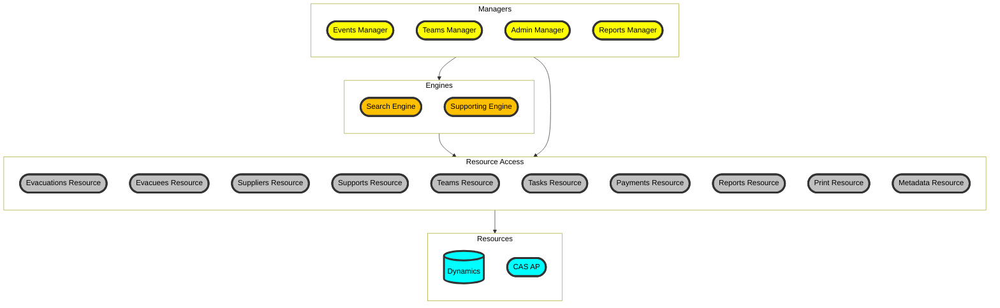

# EMBC ESS Back-end Services

Back-end service to provide data and business logic to ESS portals

## Features

- gRPC service to send and receive data from Dynamics
- business logic layer and mappings
- active background tasks to populate cache and perform timed actions
- connect to external services



## Project status

[](https://github.com/bcgov/embc-ess-mod/actions/workflows/build-ess-backend.yml)

### Dynamics OData code generation

#### Prerequisites

- [OData Connected Services extension for VS2022](https://github.com/odata/ODataConnectedService)
- Access to ERA Dynamics instance

#### Steps to update Dynamics Connected Service

1. Open `ess/src/API/EMBC.ESS.sln` in VS2022
2. run `EMBC.Tests.Integration.ESS.DynamicsBaseTests.GetSecurityToken` integration test
3. copy the Authorization header from the test output log (e.g. `Authorization: Bearer abcdefg...`)
4. right-click Connected Services/Dynamics folder and select `Update OData Connected Service`
5. paste the Authorization header into Custom Header and click next (do not check 'save custom headers')
6. if authentication is successful, the next screen will show the list of entities in Dynamics
7. Finish the update wizard to complete the generated code refresh
8. compile and run the integration tests suite to verify Dynamics integration functionality is not broken

## Steps to run locally

1. Configure the following secrets in EMBC.ESS.Host's `secerts.json`:

```json
{
    "notifications": {
        "email": {
            "smtpServer": "[smtp server]"
        }
    },
    "messaging": {
        "authorizationEnabled": "true",
        "oauth": {
            "metadataAddress": "[oauth server metadata]",
            "clientId": "[client id]",
            "clientSecret": "[client secret]",
            "scope": "ess-backend"
        }
    },
    "backgroundTask": {
        "enabled": "true"
    },
    "cas": {
        "baseUrl": "[CAS endpoint url]",
        "clientId": "[CAS client id]",
        "clientSecret": "[CAS client secret]"
    },
    "Spatial": {
        "geocoderApiKey": "[Geocoder API key]"
    },

    "Dynamics:ADFS:OAuth2TokenEndpoint": "[ADFS STS url]",
    "Dynamics:ADFS:ResourceName": "[resource name]",
    "Dynamics:ADFS:ClientId": "[ADFS client id]",
    "Dynamics:ADFS:ClientSecret": "[ADFS client sercert]",
    "Dynamics:ADFS:serviceAccountDomain": "[service account domain name]",
    "Dynamics:ADFS:serviceAccountName": "[service account name]",
    "Dynamics:ADFS:serviceAccountPassword": "[service account password]",
    "Dynamics:DynamicsApiEndpoint": "[Dynamics actual base url (proxied)]",
    "Dynamics:DynamicsApiBaseUri": "[Dynamics base url for entity names]"

}
```

2. run `EMBC.ESS.Host`

## Steps to run the integration tests

The solution has an extensive test suite. To run, configure `EMBC.ESS.Host` with the secrets and execute using Visual Studio or `dotnet test`.

The integration tests fixture will setup all required data automatically, but occasionally a full reset of the data is required. Use [cleanup.sql](../tools/scripts/dev-cleanup.sql) to reset the development environment.

Dynamics DEV environments have a nightly cleanup script that will remove any test related data.

**NOTE:** **The integration tests are not executed during CI/CD pipeline builds, it is important to run them locally while connected to the BCGOV network, and to keep them up-to-date and green**
